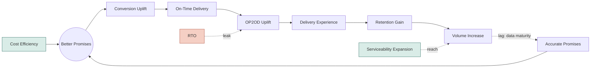

# The Logistics Growth Loop — Roadmap

*Logistics isn't a cost center that supports growth — it's a growth lever in its own right.*

**Status:** Working draft, pre-PRD · **Owner:** T. Bhalerao · **Project:** `roadmap`

---

## Executive Summary

Logistics today is measured as an execution function: did the order dispatch on time, did it arrive, what did it cost. This roadmap reframes it as a growth lever with three levers on the P&L directly — **conversion** (a faster, more credible promise wins the cart), **retention** (a promise that's kept reliably wins the customer back), and **cost** (efficiency funds the first two rather than competing with them).

The roadmap is organized around a single mechanism — the Growth Loop — and translated into 36 initiatives across four themes: **Better Promises**, **On-Time Delivery**, **OP2OD** (Order Placed → Order Delivered), and **Cost**. 24 of these already carry a quantified impact; the rest are sized as they're scoped.

**Headline targets, from what's quantified so far:**

| Metric | Baseline | Target |
|---|---|---|
| Promise Adherence Rate | 84% | **93.4%** |
| RTO Rate | 7.4% | **5.75%** |
| Conversion Rate (PDP → Order Placed) | TBD | **Baseline + 1.4pp** |
| Cost Per Order (CPO) | Rs. 59 | **Rs. 58** |

These will keep moving as the remaining initiatives get sized — this is a living number, not a final commitment.

---

## Why Logistics Is a Growth Lever, Not a Cost Center

Two different jobs sit on the same function:

- **Win the cart.** Perceived delivery speed at checkout is a conversion input. Customers benchmark it against what they'd get elsewhere in that pincode, not against a national average.
- **Win the customer back.** A promise that holds — the same way, every time — builds the trust that drives repeat orders and LTV.

A faster promise that's missed more often is a *worse* outcome than a slower one that holds: it buys one-time conversion and pays for it in long-term churn. That's why speed and adherence are tracked together throughout this roadmap, not treated as separate workstreams.

---

## The Growth Loop

The loop below is the mechanism this roadmap is built to move. Better Promises anchors the cycle. Cost Efficiency funds it from outside the loop rather than sitting in the sequence. Serviceability Expansion (reach into new pincodes) feeds Volume Increase directly, bypassing the promise/conversion chain entirely, since it creates orders that couldn't exist before rather than converting existing demand better. RTO is drawn as a leak straight into OP2OD Uplift, since OP2OD is fulfilment rate and RTO is its direct negative driver.

**On-Time Delivery** (SLA adherence — did we dispatch and route on schedule) and **OP2OD Uplift** (fulfilment rate — did the order actually get delivered) are deliberately separate nodes: a delivery can be on time and still fail, or succeed while late. Everything in the OP2OD theme below traces back to this node specifically.

---

## Roadmap by Theme

Initiatives are grouped by lever. Where several initiatives share one combined impact figure, that's stated once for the group rather than repeated per line — the group moves the metric together, not each initiative independently.

### Better Promises

*Splits into two jobs: giving a better promise (capability) and communicating it well (positioning).*

#### ETA Positioning

**Combined Impact: +1pp Conversion Uplift (PDP → Order Placed)** · Quarter: JAS

- **ETA @ Pre-Summary XP** — ETA shows only at checkout, not Cart or PDP, where earlier drop-off may be happening. → Surface the calculated ETA on Cart and PDP screens, not just Order Summary.
- **ETA Ranges XP** — Displayed ETA range is end-anchored, not centred on the real ±1-day delivery variance. → Show a ±1-day range centred on the calculated delivery date, not end-anchored.
- **ETA Framing XP** — Absolute date ranges don't match how customers think, in days until arrival, not calendar dates. → Display ETA as "Delivery in X–Y days" instead of an absolute date range.
- **Urgency Trigger XP** — Untested whether urgency/scarcity messaging near ETA would improve checkout conversion. → Test an urgency message (e.g. order-by-time countdown) alongside the displayed ETA.

Individually sized:

- **Consistent ETA** *(AMJ)* — ETA shown for the same geography varies by visit timing, even with nothing else changed. → Pin a stable ETA per geography instead of recalculating fresh on every visit. — *Impact: TBD*
- **Promise Personalisation** *(AMJ)* — ETA shown is the same for every customer, regardless of their persona. → Personalise the displayed promise based on customer persona/segment. — *Impact: TBD*

#### Hyperlocal Expansion & Network Design

**Combined Impact: SDD Order Share 30% → 50% · +0.4pp Conversion · −0.65pp RTO · −10hr Average Promise · +3.4pp Adherence**

- **Network Node Playbook** *(JAS)* — Node placement for hyperlocal expansion has no defined, repeatable signal-based decision process. → Define a repeatable scoring framework (demand, gap, cost) for where to place new nodes.
- **Competition Intelligence** *(JAS)* — We lack visibility into competitor delivery speed by geography, so gaps go unidentified. → Track competitor-promised delivery speed by geography on a recurring basis.
- **Promise Elasticity XPs** *(JAS)* — We don't know how much a faster promise actually moves conversion, traffic, or retention. → Run geography-level experiments showing a faster promise and measure demand response.
- **Clickpost Data Scraping** *(OND)* — The pincode-to-node priority list is manually built from narrower 3PL data, not Clickpost's fuller data. → Rebuild the priority list using Clickpost's richer dataset instead of manual 3PL data.

Individually sized:

- **Live Capacity-Aware ETA Calculation** *(JFM)* — Hyperlocal ETA likely uses static historical data, not real-time node and courier capacity. → Feed real-time node and courier capacity into the hyperlocal ETA calculation. — *Impact: TBD*
- **Node Allocation** *(AMJ)* — Node selection doesn't use real-time ETA to pick the fastest node. → Calculate real-time ETA per node and allocate the order to the fastest one. — *Impact: Growth Bet (not yet in the quantified set — see Open Items)*

---

### On-Time Delivery

*Owns punctuality of our own execution — did we dispatch and route on schedule.*

- **Modular Payment Pending** *(JAS)* — Unresolved payment status blocks the entire dispatch flow instead of just that step. → Decouple payment resolution from dispatch, letting other steps proceed in parallel. — **Impact: +1pp Adherence Uplift**

**Courier Selection Intelligence:**

- **Serviceability Check @ Soft Allocation** *(JAS)* — Courier-pincode serviceability isn't checked before allocation and customer ETA construction. → Add a serviceability check at soft allocation, before ETA is shown. — **Impact: Hygiene**
- **Performance Based Speed Calculation** *(JAS)* — Courier speed is assumed generically, not calculated from each courier's actual history. → Calculate each courier's expected speed from their own delivery history. — *Impact: TBD*
- **Min. Sample Size in Allocation** *(OND)* — Couriers with very few past deliveries can be judged on unreliable, noisy data. → Require a minimum delivery count before a courier's performance score is trusted. — **Impact: +3pp Adherence Uplift**
- **Promise Aware Post OP Courier Allocation** *(OND)* — Post-order allocation doesn't account for the specific promise already shown to the customer. → Constrain post-order allocation to couriers who can still honour the shown promise. — **Impact: +2pp Adherence Uplift**
- **On-Time Parameter in Courier Allocation** *(OND)* — Allocation favours cumulative by-day reliability over a courier's hit rate on the exact promised day. → Weight allocation by a courier's hit rate on the exact promised day. — *Impact: TBD*
- **Delay Risk Order Routing** *(JFM)* — Allocation doesn't account for delay risk when choosing between 3PL and hyperlocal. → Route high delay-risk orders to hyperlocal/own-fleet instead of 3PL. — *Impact: TBD (not yet in the quantified set — see Open Items)*

**In-Transit Exception Management:**

- **Post-Order ETA Updates** *(OND)* — Customers learn a delivery is late only after it's already late, not when drift starts. → Push a revised ETA to the customer as soon as drift is detected. — **Impact: −10% Delivery-Related Support Tickets**

---

### OP2OD (Order Placed → Order Delivered)

*Owns whether the delivery is actually completed — fulfilment rate, and the direct target of the RTO leak.*

#### Address Quality

**Combined Impact: −0.2pp RTO** · Quarter: OND

- **Lat Long Based Address Capture** — New-customer addresses rely on error-prone free text, with no captured GPS signal. → Capture a GPS pin alongside the text address at order placement.
- **Past Delivery Location Lat Long** — Returning customers' orders trust re-entered addresses over their proven past delivery location. → Default returning customers to the lat-long of their last successful delivery.

Individually sized:

- **Directions to Reach** *(AMJ)* — GPS alone doesn't reach the exact door in dense or gated addresses. → Capture landmark and unit-level detail, and surface it in the courier's navigation. — *Impact: TBD*

#### Customer Availability & Reattempt Policy

**Combined Impact: −0.8pp RTO** · Quarter: JFM

- **Preferred Delivery Date** — Customers can't proactively commit to a delivery window that suits them. → Let customers select a preferred delivery date at or after order placement.
- **Communications Revamp** — Customer communications aren't optimised across channel, tonality, trigger, or frequency. → Rethink communications holistically — channel, tonality, trigger, and frequency — starting with the out-for-delivery message.
- **Reschedule Delivery** — Customers can't reschedule when they know they'll be unavailable, so attempts fail needlessly. → Add a one-tap reschedule action to the out-for-delivery notification.
- **Reattempt Visibility** — Customers aren't told when the next attempt is coming after a failed delivery. → Notify the customer proactively with the scheduled time of the next attempt.
- **NDR Management** — NDR resolution isn't real-time, delaying fixes into the next available slot. → Run a real-time NDR loop over WhatsApp and voice AI for immediate resolution.

#### Handover Mechanics

- **OTP Based Deliveries** *(JFM)* — There's no verification that the right person is receiving the order at handover. → Require OTP verification from the customer at the point of handover. — *Impact: TBD*
- **Call Masking** *(JFM)* — Exposed phone numbers hurt privacy and may reduce willingness to answer courier calls. → Mask courier and customer numbers behind a proxy number for coordination calls. — *Impact: TBD*

---

### Cost

*Funds Better Promises from outside the loop — the enabling input, not a step in the sequence.*

**Combined Impact: −Rs. 1 CPO Reduction**

- **DMS** *(Route Efficiency, OND)* — Riders plan routes manually via paper lists, with no sequenced drop optimisation. → Roll out a DMS with route/beat planning and sequenced drop optimisation.
- **DMS** *(Supply Planning, OND)* — Without route-level data, Ops can't size hiring or run driver retention incentives. → Use DMS route data to size hiring needs and run driver incentive programs.
- **Mid-Mile Entity** *(Dispatch Efficiency, JAS)* — The system doesn't recognise mid-mile entities like hubs as distinct trackable units. → Model hubs and other mid-mile points as trackable entities in the system.
- **AWB Identifier Code** *(Dispatch Efficiency, OND)* — AWBs carry no route or delivery-zone code, making order sorting manual and slow. → Print a route/zone code on the AWB to enable automated sorting.

Individually sized:

- **Handover Validation** *(Dispatch Efficiency, OND)* — Parcels aren't validated at any handover across warehouse, dispatch, mid-mile, or hub ops. → Validate parcel handoff at each stage: warehouse, dispatch, mid-mile, and hub. — **Impact: Hygiene**
- **Performance Tolerance Based on Cost** *(Cost Aware Courier Allocation, JFM)* — Courier allocation doesn't explicitly trade off cost against performance. → Allocate couriers using an explicit cost-versus-performance tradeoff threshold. — *Impact: TBD (not yet in the quantified set — see Open Items)*

---

## Metrics Referenced

New metrics surfaced by the quantified impacts above, alongside the four headline metrics. Baselines TBD where not yet available.

| Metric | Definition | Baseline | Target |
|---|---|---|---|
| Promise Adherence Rate | % of orders delivered on or before the promised date | 84% | 93.4% |
| RTO Rate | % of dispatched orders returned to origin, undelivered | 7.4% | 5.75% |
| Conversion Rate (PDP → OP) | % of PDP visitors who go on to place an order | TBD | Baseline + 1.4pp |
| Cost Per Order (CPO) | Blended logistics cost-to-serve per delivered order | Rs. 59 | Rs. 58 |
| SDD Order Share | % of orders fulfilled same-day | TBD | 30% → 50% |
| Average Promise | Average promised delivery time shown to customers | TBD | −10hr |
| Delivery-Related Support Tickets | Support tickets tagged to a delivery issue | TBD | −10% |

---

## Open Items

Four initiatives currently carry a TBD or placeholder impact because they weren't part of the latest quantified impact pass and need sizing:

- **Node Allocation** (Better Promises → Network Design) — still at "Growth Bet"
- **Delay Risk Order Routing** (On-Time Delivery → Courier Selection Intelligence)
- **Promise Personalisation** (Better Promises → ETA Positioning)
- **Performance Tolerance Based on Cost** (Cost → Cost Aware Courier Allocation)

Also worth flagging: the reference sheet used for this pass includes several combined-impact figures (SDD Order Share, Average Promise, Delivery-Related Support Tickets) that don't yet have a documented current baseline. Recommend pulling those before this goes to leadership for sign-off, so every target in the headline table has a real starting point behind it.

---

*Source: converted from the working HTML draft, cross-referenced against the [reference impact/quarter sheet](https://docs.google.com/spreadsheets/d/1i5NZPAkrQtQ9aqiur-SqL8abfA7HzZvWCgFoqCNjaqo/edit) for Impact and Execution Quarter values. Problem/Intervention text and initiative scoping reflect the working session that built this roadmap.*
