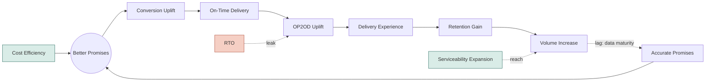

# The Logistics Growth Loop — Roadmap

*Logistics isn't a cost center that supports growth — it's a growth lever in its own right.*

**Status:** Working draft, pre-PRD · **Owner:** T. Bhalerao · **Project:** `roadmap`

---

## We are currently in the wrong quadrant of our own strategy

Every logistics strategy in this company has converged on the same chart: adherence on one axis, promised speed on the other, four quadrants, one target.

| | Slow promise | Fast promise |
|---|---|---|
| **High adherence (>90%)** | Trust, Capped — retention protected, growth capped | **The Target** — conversion and LTV compound together |
| **Low adherence** | Losing on Both — no conversion, no trust | Churn Engine — wins the cart, loses the customer |

**We sit at 84% adherence today.** That's below the line that separates a business that compounds from one that doesn't. Every rupee spent making promises faster without fixing this number moves us toward Churn Engine, not The Target. That is the single fact this entire roadmap exists to fix.

This document is not a wishlist. It is 36 initiatives, each one traced back through a causal chain to a specific point where the loop breaks, 24 of them already carrying a quantified number and a shipping quarter. Executed, they move us from below the line to **93.4% adherence** — inside The Target quadrant — while cutting RTO by **22%** and CPO by **1.7%**, and they do it without trading one metric for the other, which is the only way this actually compounds.

---

## The headline numbers

| Metric | Baseline | Target | Movement |
|---|---|---|---|
| **Promise Adherence Rate** | 84% | **93.4%** | +9.4pp — crosses the >90% "Target quadrant" line |
| **RTO Rate** | 7.4% | **5.75%** | −1.65pp, a **22% relative reduction** |
| **Cost Per Order (CPO)** | Rs. 59 | **Rs. 58** | −Rs. 1, a **1.7% relative reduction** |
| **SDD Order Share** | 30% | **50%** | +20pp, a **67% relative increase** |
| Conversion Rate (PDP → Order Placed) | TBD | Baseline **+1.4pp** | pending baseline capture |

These are not projections pulled from a benchmark deck. Every figure above is the sum of specific, named, quarter-tagged initiatives lower in this document — trace any number here back to exactly which piece of work produces it. **12 more initiatives are in the next sizing wave** and will only make these numbers move further in our favour.

To turn any of these into a rupee figure for this quarter's board deck: multiply the CPO line by current order volume for a monthly cost saving, and the conversion/adherence lines by order volume × AOV for the retention and revenue read. Give me the volume number and I'll run it live rather than have you do the math by hand.

---

## Why this is a growth investment, not an ops fix

Two different jobs sit on the same function, and conflating them is why logistics gets funded like a cost center instead of a growth lever:

- **Win the cart.** Perceived delivery speed at checkout is a conversion input, benchmarked by the customer against quick-commerce in *their* pincode — not against our national average. That's a demand-generation lever.
- **Win the customer back.** A promise that holds, identically, every time, is what converts a first order into a habit. That's a retention lever, and it's worth more per rupee than the first one, because it compounds.

The asymmetry that makes this urgent: **a faster promise that's missed more often is a worse commercial outcome than a slower one that holds.** Push speed without fixing adherence and we buy one-time conversion and pay for it in churn — the Churn Engine quadrant, and it's a trap that gets more expensive to escape the longer we sit in it. That's why every initiative in this roadmap is tagged to a specific metric and a specific quarter, not bundled into a generic "logistics improvements" line — so nobody can quietly ship speed without adherence, or adherence without speed, and call it progress.

---

## How these numbers were actually derived

The credibility of a 93.4% target rests entirely on whether the arithmetic underneath it holds up, so here's the method, not just the output:

1. **Started from the mechanism, not the metric.** The Growth Loop below was built first — mapping exactly how a promise turns into conversion, how conversion turns into fulfilment risk, how fulfilment turns into retention, and where cost re-enters as the thing funding the whole cycle. Every initiative had to earn its place by pointing at a specific node or leak in that loop, not just sound useful.
2. **Decomposed each broken node with first-principles questions**, not a brainstorm. OP2OD's five levers, for instance, came from walking the literal physical path an order takes from courier-arrives-in-vicinity to handover-complete, and asking what breaks at each step — which is why Address Quality, Customer Availability, and Handover Mechanics are three separate levers with three separate owners, not one generic "delivery experience" bucket.
3. **Cross-checked against a stakeholder's independent strategic vision deck** for the same problem, initiative by initiative — several ideas here were caught as duplicates of that deck's thinking and merged rather than double-built; several gaps in that deck (a personalisation layer, a monetized speed tier) were caught and are now in this roadmap instead.
4. **Rejected ideas that didn't survive scrutiny**, on the record. A "dynamic dispatch batching" initiative was killed outright because 3PL pickup windows are fixed and no product change moves them. A courier-monitoring initiative was killed and rebuilt because the original framing measured people instead of building them a better tool. That discipline is what keeps the 24 quantified numbers honest.
5. **Reconciled against the live impact-sizing sheet** the team is running in parallel, so the numbers in this document match what's actually being tracked operationally, not a stale snapshot.

---

## The Growth Loop

Better Promises anchors the cycle. Cost Efficiency funds it from outside the loop rather than sitting in the sequence — it's what makes a better promise affordable, not a step you pass through. Serviceability Expansion (reach into new pincodes) feeds Volume Increase directly, bypassing the promise/conversion chain entirely, because it creates orders that couldn't exist before rather than converting existing demand better. RTO is drawn as a leak straight into OP2OD Uplift, since OP2OD is fulfilment rate and RTO is its direct negative driver.

**On-Time Delivery** (did we dispatch and route on schedule) and **OP2OD Uplift** (did the order actually get delivered) are deliberately separate nodes: a delivery can be on time and still fail, or succeed while late. Confusing the two is exactly how a team ends up optimizing dispatch punctuality while RTO quietly climbs — the roadmap below keeps them as separately owned levers so that can't happen unnoticed.

---

## The roadmap, by theme

Every initiative below carries a problem it fixes, the intervention that fixes it, the quarter it ships, and — where already sized — the metric it moves. Initiatives that share one combined figure are grouped under it once; that group moves the number together, not each line independently.

### Better Promises

*Two jobs: give a better promise, and communicate it well.*

#### ETA Positioning

**Combined Impact: +1pp Conversion Uplift (PDP → Order Placed)** · Ships JAS

- **ETA @ Pre-Summary XP** — ETA shows only at checkout, not Cart or PDP, where earlier drop-off may be happening. → Surface the calculated ETA on Cart and PDP screens, not just Order Summary.
- **ETA Ranges XP** — Displayed ETA range is end-anchored, not centred on the real ±1-day delivery variance. → Show a ±1-day range centred on the calculated delivery date.
- **ETA Framing XP** — Absolute date ranges don't match how customers think, in days until arrival, not calendar dates. → Display ETA as "Delivery in X–Y days" instead of an absolute date range.
- **Urgency Trigger XP** — Untested whether urgency/scarcity messaging near ETA would improve checkout conversion. → Test an order-by-time countdown alongside the displayed ETA.

Next sizing wave:

- **Consistent ETA** *(AMJ)* — Same geography, different visit, different ETA — undermines trust independent of accuracy. → Pin a stable ETA per geography instead of recalculating on every visit.
- **Promise Personalisation** *(AMJ)* — One ETA for every customer regardless of persona. → Personalise the displayed promise by customer segment.

#### Hyperlocal Expansion & Network Design

**Combined Impact: SDD Order Share 30% → 50% · +0.4pp Conversion · −0.65pp RTO · −10hr Average Promise · +3.4pp Adherence** — the single largest bundle in this roadmap

- **Network Node Playbook** *(JAS)* — Node placement has no defined, repeatable, signal-based decision process. → A repeatable scoring framework (demand, gap, cost) for new-node placement.
- **Competition Intelligence** *(JAS)* — No visibility into competitor delivery speed by geography. → Track competitor-promised speed by geography, on a recurring cadence.
- **Promise Elasticity XPs** *(JAS)* — We don't know how much a faster promise actually moves conversion, traffic, or retention. → Geography-level experiments measuring real demand response to speed.
- **Clickpost Data Scraping** *(OND)* — Pincode-to-node priority list is hand-built from narrower 3PL data. → Rebuild it on Clickpost's fuller dataset.

Next sizing wave:

- **Live Capacity-Aware ETA Calculation** *(JFM)* — Hyperlocal ETA uses static history, not real-time capacity. → Feed real-time node/courier capacity into the ETA calculation.
- **Node Allocation** *(AMJ)* — Node selection ignores real-time ETA. → Calculate live ETA per node, allocate to the fastest.

---

### On-Time Delivery

*Owns punctuality of our own execution.*

- **Modular Payment Pending** *(JAS)* — Unresolved payment status blocks the entire dispatch flow, not just that one step. → Decouple payment resolution so other steps proceed in parallel. — **+1pp Adherence**

**Courier Selection Intelligence:**

- **Serviceability Check @ Soft Allocation** *(JAS)* — Courier-pincode serviceability isn't checked before allocation. → Check it at soft allocation, before the customer ever sees an ETA. — **Hygiene**
- **Min. Sample Size in Allocation** *(OND)* — Couriers with almost no delivery history get judged on noise. → Require a minimum sample before a performance score is trusted. — **+3pp Adherence**
- **Promise Aware Post OP Courier Allocation** *(OND)* — Post-order allocation ignores the specific promise already shown. → Constrain allocation to couriers who can still honour it. — **+2pp Adherence**
- **Performance Based Speed Calculation** *(JAS)* — Courier speed is a generic assumption, not derived from that courier's history.
- **On-Time Parameter in Courier Allocation** *(OND)* — Allocation optimizes cumulative reliability, not hit rate on the exact promised day.
- **Delay Risk Order Routing** *(JFM)* — Allocation doesn't weigh delay risk when choosing 3PL vs. hyperlocal. *(next sizing wave)*

**In-Transit Exception Management:**

- **Post-Order ETA Updates** *(OND)* — Customers learn a delivery is late only once it's already late. → Push a revised ETA the moment drift is detected. — **−10% delivery-related support tickets**

---

### OP2OD — Order Placed to Order Delivered

*Owns whether the order is actually completed. This is where the RTO leak gets closed.*

#### Address Quality

**Combined Impact: −0.2pp RTO** · Ships OND

- **Lat Long Based Address Capture** — New-customer addresses rely on error-prone free text. → Capture a GPS pin at order placement.
- **Past Delivery Location Lat Long** — Returning customers' proven delivery location is ignored in favour of re-entered text. → Default to the last successful delivery's coordinates.

Next sizing wave: **Directions to Reach** *(AMJ)* — GPS gets a courier to the building, not the door in dense/gated addresses.

#### Customer Availability & Reattempt Policy

**Combined Impact: −0.8pp RTO** · Ships JFM — the largest single RTO lever in the roadmap

- **Preferred Delivery Date** — No way for a customer to proactively commit to a window that suits them.
- **Communications Revamp** — Communications aren't optimised across channel, tonality, trigger, or frequency, starting with the out-for-delivery message.
- **Reschedule Delivery** — No way to reschedule a known-unavailable slot, so the attempt fails needlessly instead of being avoided.
- **Reattempt Visibility** — Customers aren't told when the next attempt is coming after a failure.
- **NDR Management** — Non-delivery resolution isn't real-time, so fixes miss the next available slot.

#### Handover Mechanics

- **OTP Based Deliveries** *(JFM)* — No verification the right person is receiving the order. *(next sizing wave)*
- **Call Masking** *(JFM)* — Exposed phone numbers hurt privacy and may suppress answer rates on courier calls. *(next sizing wave)*

---

### Cost

*Funds Better Promises from outside the loop — this is what makes speed affordable, not a competing priority.*

**Combined Impact: −Rs. 1 CPO**

- **DMS** *(Route Efficiency + Supply Planning, OND)* — Riders plan routes manually off paper lists; Ops has no route-level data to size hiring or run retention incentives. → One system: route/beat planning, sequenced drops, and the data to plan the fleet.
- **Mid-Mile Entity** *(JAS)* — Hubs and other mid-mile points aren't recognised as trackable entities. → Model them as first-class, trackable units.
- **AWB Identifier Code** *(OND)* — AWBs carry no route/zone code, so sorting is manual. → Print a route/zone code for automated sorting.

Separately: **Handover Validation** *(OND)* — no validation at any handover across warehouse, dispatch, mid-mile, or hub — **Hygiene**. **Performance Tolerance Based on Cost** *(JFM, next sizing wave)* — allocation doesn't trade off cost against performance explicitly.

---

## Metrics behind every number above

| Metric | Definition | Baseline | Target |
|---|---|---|---|
| Promise Adherence Rate | % of orders delivered on or before the promised date | 84% | **93.4%** |
| RTO Rate | % of dispatched orders returned to origin, undelivered | 7.4% | **5.75%** |
| Cost Per Order (CPO) | Blended logistics cost-to-serve per delivered order | Rs. 59 | **Rs. 58** |
| SDD Order Share | % of orders fulfilled same-day | TBD | **30% → 50%** |
| Conversion Rate (PDP → OP) | % of PDP visitors who place an order | TBD | Baseline **+1.4pp** |
| Average Promise | Average promised delivery time shown to customers | TBD | **−10hr** |
| Delivery-Related Support Tickets | Support tickets tagged to a delivery issue | TBD | **−10%** |

Three of these seven metrics don't have a documented baseline yet (SDD Order Share, Average Promise, Support Tickets, and Conversion). That's not a gap in the plan — it's the next concrete task before this goes in front of anyone who'll ask "compared to what."

---

## Next sizing wave

Six initiatives are scoped, quarter-tagged, and not yet quantified. This is a punch list, not a risk:

| Initiative | Theme → Lever | Ships |
|---|---|---|
| Node Allocation | Better Promises → Network Design | AMJ |
| Consistent ETA | Better Promises → ETA Positioning | AMJ |
| Promise Personalisation | Better Promises → ETA Positioning | AMJ |
| Live Capacity-Aware ETA Calculation | Better Promises → Hyperlocal Expansion | JFM |
| Delay Risk Order Routing | On-Time Delivery → Courier Selection Intelligence | JFM |
| Performance Tolerance Based on Cost | Cost → Cost Aware Courier Allocation | JFM |

Plus three more with an interim placeholder rather than a number: Performance Based Speed Calculation, On-Time Parameter in Courier Allocation, OTP Based Deliveries, Call Masking, Directions to Reach — each already has a clear problem and intervention, just not yet a sized metric.

---

*Source: built from a first-principles decomposition of the Growth Loop, cross-referenced against an independent stakeholder strategic vision deck, and reconciled against the [live impact/quarter tracking sheet](https://docs.google.com/spreadsheets/d/1i5NZPAkrQtQ9aqiur-SqL8abfA7HzZvWCgFoqCNjaqo/edit). Not yet through formal PRD sign-off.*
