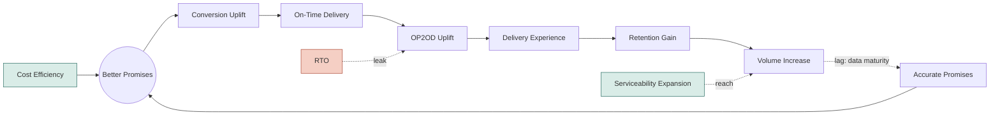

# The Logistics Growth Loop — Roadmap

*Logistics isn't a cost center that supports growth — it's a growth lever in its own right.*

**Status:** Working draft, pre-PRD · **Owner:** T. Bhalerao · **Project:** `roadmap`

---

## The Growth Loop

Better Promises anchors the cycle. Cost Efficiency funds it from outside the loop rather than sitting in the sequence — it's what makes a better promise affordable, not a step you pass through. Serviceability Expansion (reach into new pincodes) feeds Volume Increase directly, bypassing the promise/conversion chain, because it creates orders that couldn't exist before rather than converting existing demand better. RTO is drawn as a leak straight into OP2OD Uplift, since OP2OD is fulfilment rate and RTO is its direct negative driver.

**On-Time Delivery** (did we dispatch and route on schedule) and **OP2OD Uplift** (did the order actually get delivered) are kept as separate nodes: a delivery can be on time and still fail, or succeed while late.

---

## Levers

The loop is a mechanism. Levers are what you actually pull. Every initiative below sits under exactly one — this section is the map from one to the other.

| Loop Element | What It Intends to Cover | Levers |
|---|---|---|
| Better Promises | Giving a better promise and communicating it well — two separate jobs, two owners | ETA Positioning *(communicate)* Hyperlocal Expansion *(give)* Network Design *(give)* Network Optimisation *(give)* — no initiative yet Dispatch Waves *(give)* — blocked, fixed 3PL windows |
| On-Time Delivery | Punctuality of our own execution — did we dispatch and route on schedule, distinct from OP2OD | Dispatch On-Time Courier Selection Intelligence In-Transit Exception Management |
| OP2OD Uplift | Did the order actually get delivered — RTO's direct target, tracing the order's path from locate to retry | Address Quality Customer Availability Delivery Attempt Diligence — no initiative yet Handover Mechanics Reattempt & RTO Policy |
| Cost Efficiency | Funds Better Promises from outside the loop — an input, not a step in the sequence | Route Efficiency Supply Planning Dispatch Efficiency RTO Cost — no initiative yet Cost Aware Courier Allocation |

---

## JAS

*In motion: Better Promises (ETA Positioning, Hyperlocal Expansion) · On-Time Delivery (Dispatch On-Time, Courier Selection Intelligence) · Cost (Dispatch Efficiency)*

| Initiative | Lever | Problem → Intervention | Impact |
|---|---|---|---|
| ETA @ Pre-Summary XP | ETA Positioning | ETA shows only at checkout, not Cart or PDP, where earlier drop-off may be happening. → Surface the calculated ETA on Cart and PDP screens, not just Order Summary. | ▸ +1pp Conversion *(bundle of 4)* |
| ETA Ranges XP | ETA Positioning | Displayed ETA range is end-anchored, not centred on the real ±1-day delivery variance. → Show a ±1-day range centred on the calculated delivery date, not end-anchored. | ▸ same bundle |
| ETA Framing XP | ETA Positioning | Absolute date ranges don't match how customers think — in days until arrival, not calendar dates. → Display ETA as "Delivery in X–Y days" instead of an absolute date range. | ▸ same bundle |
| Urgency Trigger XP | ETA Positioning | Untested whether urgency/scarcity messaging near ETA would improve checkout conversion. → Test an urgency message (e.g. order-by-time countdown) alongside the displayed ETA. | ▸ same bundle |
| Network Node Playbook | Hyperlocal Expansion | Node placement for hyperlocal expansion has no defined, repeatable signal-based decision process. → Define a repeatable scoring framework (demand, gap, cost) for where to place new nodes. | ▸ SDD 30%→50%, +0.4pp Conversion, −0.65pp RTO, −10hr Promise, +3.4pp Adherence *(bundle of 4)*† |
| Competition Intelligence | Hyperlocal Expansion | We lack visibility into competitor delivery speed by geography, so gaps go unidentified. → Track competitor-promised delivery speed by geography on a recurring basis. | ▸ same bundle† |
| Promise Elasticity XPs | Hyperlocal Expansion | We don't know how much a faster promise actually moves conversion, traffic, or retention. → Run geography-level experiments showing a faster promise and measure demand response. | ▸ same bundle† |
| Performance Based Speed Calculation | Courier Selection Intelligence | Courier speed is assumed generically, not calculated from each courier's actual history. → Calculate each courier's expected speed from their own delivery history. | TBD |
| Modular Payment Pending | Dispatch On-Time | Unresolved payment status blocks the entire dispatch flow instead of just that step. → Decouple payment resolution from dispatch, letting other steps proceed in parallel. | +1pp Adherence |
| Serviceability Check @ Soft Allocation | Courier Selection Intelligence | Courier-pincode serviceability isn't checked before allocation and customer ETA construction. → Add a serviceability check at soft allocation, before ETA is shown. | Hygiene |
| Mid-Mile Entity | Dispatch Efficiency | The system doesn't recognise mid-mile entities like hubs as distinct trackable units. → Model hubs and other mid-mile points as trackable entities in the system. | ▸ −Rs. 1 CPO *(bundle of 5)*‡ |

*†bundle completes with Clickpost Data Scraping, shipping OND · ‡bundle completes with DMS ×2 and AWB Identifier Code, shipping OND*

---

## OND

*In motion: Better Promises (Network Design) · On-Time Delivery (Courier Selection Intelligence, In-Transit Exception Management) · OP2OD (Address Quality) · Cost (Route Efficiency, Supply Planning, Dispatch Efficiency)*

| Initiative | Lever | Problem → Intervention | Impact |
|---|---|---|---|
| Clickpost Data Scraping | Network Design | The pincode-to-node priority list is manually built from narrower 3PL data, not Clickpost's fuller data. → Rebuild the priority list using Clickpost's richer dataset instead of manual 3PL data. | ▸ SDD 30%→50%, +0.4pp Conversion, −0.65pp RTO, −10hr Promise, +3.4pp Adherence *(bundle of 4)* — completes the JAS bundle |
| Min. Sample Size in Allocation | Courier Selection Intelligence | Couriers with very few past deliveries can be judged on unreliable, noisy data. → Require a minimum delivery count before a courier's performance score is trusted. | +3pp Adherence |
| Promise Aware Post OP Courier Allocation | Courier Selection Intelligence | Post-order allocation doesn't account for the specific promise already shown to the customer. → Constrain post-order allocation to couriers who can still honour the shown promise. | +2pp Adherence |
| On-Time Parameter in Courier Allocation | Courier Selection Intelligence | Allocation favours cumulative by-day reliability over a courier's hit rate on the exact promised day. → Weight allocation by a courier's hit rate on the exact promised day. | TBD |
| Post-Order ETA Updates | In-Transit Exception Management | Customers learn a delivery is late only after it's already late, not when drift starts. → Push a revised ETA to the customer as soon as drift is detected. | −10% delivery-related support tickets |
| Lat Long Based Address Capture | Address Quality | New-customer addresses rely on error-prone free text, with no captured GPS signal. → Capture a GPS pin alongside the text address at order placement. | ▸ −0.2pp RTO *(bundle of 2)* |
| Past Delivery Location Lat Long | Address Quality | Returning customers' orders trust re-entered addresses over their proven past delivery location. → Default returning customers to the lat-long of their last successful delivery. | ▸ same bundle |
| DMS | Route Efficiency | Riders plan routes manually via paper lists, with no sequenced drop optimisation. → Roll out a DMS with route/beat planning and sequenced drop optimisation. | ▸ −Rs. 1 CPO *(bundle of 5)* — completes the JAS bundle |
| DMS | Supply Planning | Without route-level data, Ops can't size hiring or run driver retention incentives. → Use DMS route data to size hiring needs and run driver incentive programs. | ▸ same bundle |
| AWB Identifier Code | Dispatch Efficiency | AWBs carry no route or delivery-zone code, making order sorting manual and slow. → Print a route/zone code on the AWB to enable automated sorting. | ▸ same bundle |
| Handover Validation | Dispatch Efficiency | Parcels aren't validated at any handover across warehouse, dispatch, mid-mile, or hub ops. → Validate parcel handoff at each stage: warehouse, dispatch, mid-mile, and hub. | Hygiene |

---

## JFM

*In motion: Better Promises (Hyperlocal Expansion) · On-Time Delivery (Courier Selection Intelligence) · OP2OD (Customer Availability, Reattempt & RTO Policy, Handover Mechanics) · Cost (Cost Aware Courier Allocation)*

| Initiative | Lever | Problem → Intervention | Impact |
|---|---|---|---|
| Live Capacity-Aware ETA Calculation | Hyperlocal Expansion | Hyperlocal ETA likely uses static historical data, not real-time node and courier capacity. → Feed real-time node and courier capacity into the hyperlocal ETA calculation. | TBD |
| Delay Risk Order Routing | Courier Selection Intelligence | Allocation doesn't account for delay risk when choosing between 3PL and hyperlocal. → Route high delay-risk orders to hyperlocal/own-fleet instead of 3PL. | TBD |
| Preferred Delivery Date | Customer Availability | Customers can't proactively commit to a delivery window that suits them. → Let customers select a preferred delivery date at or after order placement. | ▸ −0.8pp RTO *(bundle of 5)* |
| Communications Revamp | Customer Availability | Customer communications aren't optimised across channel, tonality, trigger, or frequency. → Rethink communications holistically — channel, tonality, trigger, and frequency — starting with the out-for-delivery message. | ▸ same bundle |
| Reschedule Delivery | Customer Availability | Customers can't reschedule when they know they'll be unavailable, so attempts fail needlessly. → Add a one-tap reschedule action to the out-for-delivery notification. | ▸ same bundle |
| Reattempt Visibility | Reattempt & RTO Policy | Customers aren't told when the next attempt is coming after a failed delivery. → Notify the customer proactively with the scheduled time of the next attempt. | ▸ same bundle |
| NDR Management | Reattempt & RTO Policy | NDR resolution isn't real-time, delaying fixes into the next available slot. → Run a real-time NDR loop over WhatsApp and voice AI for immediate resolution. | ▸ same bundle |
| OTP Based Deliveries | Handover Mechanics | There's no verification that the right person is receiving the order at handover. → Require OTP verification from the customer at the point of handover. | TBD |
| Call Masking | Handover Mechanics | Exposed phone numbers hurt privacy and may reduce willingness to answer courier calls. → Mask courier and customer numbers behind a proxy number for coordination calls. | TBD |
| Performance Tolerance Based on Cost | Cost Aware Courier Allocation | Courier allocation doesn't explicitly trade off cost against performance. → Allocate couriers using an explicit cost-versus-performance tradeoff threshold. | TBD |

---

## AMJ

*In motion: Better Promises (ETA Positioning, Network Design) · OP2OD (Address Quality)*

| Initiative | Lever | Problem → Intervention | Impact |
|---|---|---|---|
| Consistent ETA | ETA Positioning | ETA shown for the same geography varies by visit timing, even with nothing else changed. → Pin a stable ETA per geography instead of recalculating fresh on every visit. | TBD |
| Promise Personalisation | ETA Positioning | ETA shown is the same for every customer, regardless of their persona. → Personalise the displayed promise based on customer persona/segment. | TBD |
| Node Allocation | Network Design | Node selection doesn't use real-time ETA to pick the fastest node. → Calculate real-time ETA per node and allocate the order to the fastest one. | Growth Bet |
| Directions to Reach | Address Quality | GPS alone doesn't reach the exact door in dense or gated addresses. → Capture landmark and unit-level detail, and surface it in the courier's navigation. | TBD |

---

## Metrics Targeted, Across All Four Quarters

| Metric | Baseline | Target |
|---|---|---|
| Promise Adherence Rate | 84% | 93.4% |
| RTO Rate | 7.4% | 5.75% |
| Cost Per Order (CPO) | Rs. 59 | Rs. 58 |
| SDD Order Share | TBD | 30% → 50% |
| Conversion Rate (PDP → OP) | TBD | Baseline +1.4pp |
| Average Promise | TBD | −10hr |
| Delivery-Related Support Tickets | TBD | −10% |

---

*Source: reconciled against the [live impact/quarter tracking sheet](https://docs.google.com/spreadsheets/d/1i5NZPAkrQtQ9aqiur-SqL8abfA7HzZvWCgFoqCNjaqo/edit). Not yet through formal PRD sign-off.*
